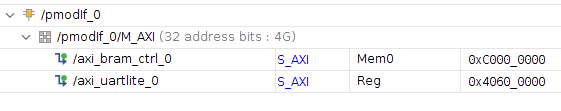

## pico-xvc

This project implements a Raspberry Pico based Xilinx Virtual Cable (XVC). It
allows using Raspberry Pico as a JTAG adapter for programming Xilinx FPGAs.

It is derived from the excellent [pico-dirtyJtag](https://github.com/phdussud/pico-dirtyJtag/) project.

The pinout is as follows:

| Pin name | GPIO   |
|:---------|:-------|
| TDI      | GPIO16 |
| TDO      | GPIO17 |
| TCK      | GPIO18 |
| TMS      | GPIO19 |
| GND      | Pin 23 |

Note: The Raspberry Pico is a 3.3v device. Ensure that the target device and
the Pico are electrically compatible before connecting them.


Note: This project was tested with Vivado 2021.1, Raspberry Pico as the JTAG
programmer (XVC server), and EBAZ4205 'Development' FPGA Board in August 2021.


### Building pico-xvc

Install dependencies:

```
sudo apt install cmake gcc-arm-none-eabi libnewlib-arm-none-eabi \
  libstdc++-arm-none-eabi-newlib git libusb-1.0-0-dev build-essential \
  make g++ gcc
```

```
mkdir ~/repos
cd ~/repos

git clone https://github.com/raspberrypi/pico-sdk.git
# git clone https://github.com/kholia/xvc-pico.git
git clone https://github.com/tom01h/xvc-pico
```

Build the host-side daemon:

```
cd ~/repos/xvc-pico/daemon
cmake .
make
sudo ./xvcd-pico  # run on the host computer
```

Build the Raspberry Pico's firmware:

```
cd ~/repos/xvc-pico/firmware
export PICO_SDK_PATH=${HOME}/repos/pico-sdk
export CFLAGS="-Wall -Wextra -Wno-unused-function -Wno-unused-parameter -Wno-unused-but-set-variable"
cmake .
make -j4
```

Upload `xvcPico.uf2` file to the Raspberry Pico Board.


### Usage

Select the `Add Xilinx Virtual Cable (XVC)` option in the `Hardware
Manager` in Vivado and mention the `IP address` of the host computer.


### Tips

If you see the `End of startup status: LOW` error message in Vivado, check the
FPGA power supply's voltage and current ratings.

I found `Maker Pi Pico Base` really helpful for debugging GPIO stuff.

[This URL](https://github.com/aws/aws-fpga/blob/master/hdk/docs/Virtual_JTAG_XVC.md)
says that Xilinx Virtual Cable (XVC) protocol allows (local or remote) Vivado
to connect to a target FPGA for debug leveraging standard Xilinx standard debug
cores like Integrated Logic Analyzer - ILA, Virtual Input/Output - VIO, and
others. So `ILA` should 'work' over our Raspberry Pico JTAG adapter.


### Rough Performance Stats ("Speed")

If cost and ease-of-availability are the driving constraints (at the cost of
speed), then this project is 'usable' and can probably suffice. If higher
programming speed is a requirement, I recommend using `xc3sprog` or
`openFPGALoader` with an FT2232H board.

This project might be one of the cheapest, most energy-efficient `Vivado-Compatible`
JTAG programmers. I use this project as my "daily driver" now ;)


### Related Ideas / Projects

- https://github.com/kholia/xvcpi
- https://github.com/kholia/xvc-esp32
- https://github.com/kholia/xvc-esp8266
- https://github.com/phdussud/pico-dirtyJtag/
  - Reuse PIO stuff
  - Implement 'XVC' on top of regular 'DirtyJTAG' protocol
- https://github.com/kholia/Colorlight-5A-75B
- https://github.com/fusesoc/blinky#ebaz4205-development-board
- https://github.com/maxnet/pico-webserver/ approach (LWIP_SOCKET is not available yet!)


## おまけ

### USB UART

pico の↓のハードウエア UART ピンを FPGA の UART とつなぐ。

```
#define UART_TX_PIN 0
#define UART_RX_PIN 1
```

FPGA の UART は 115200bps に設定する。

pico の USB をつなぐと /dev/ttyACMn が生えてくる。

### PC から FPGA の AXIバスマスタをコントロールする。

FPGA には↓のファイルをインスタンスする。

```
fpga/busIf.sv  fpga/pmodCmd.sv  fpga/pmodIf.v
```

pmodIf の端子と pico の↓をつなぐ。

```
#define PCK_PIN 6
#define PWRITE_PIN 7
#define PWD0_PIN 8
#define PWD1_PIN 9
#define PRD0_PIN 10
#define PRD1_PIN 11
#define PWAIT_PIN 4
```

`host/main.c` を参考に、書き込みは `send_data.data` にデータを書いて `write_dev(SIZE, waddress, send_data);`。

読み出しは `read_dev(SIZE, raddress, receive_data);` を実行すると `receive_data` に読み出しデータが書き込まれる。

シングル転送時には、SIZE には 1,2,4 バイト時は 1,2,4 を、8バイト時は 6 を設定する。

バースト転送は 8バイト×128バーストまで対応。(バースト長-1)×8 を SIZE に設定する。バースト転送は ４KB 境界をまたいではいけない。

最大バースト時に書き込み、読み出しともに 5Mbps 弱の速度で動く。

### サンプル

`host/main.c` は pmodIf に AXI UART Lite と BRAM Ctrl を繋いだ回路を動くすサンプルです。 

BRAM に 1KB のデータを読み書きする時間を計測して、UART に出力します。

アドレスは以下のように設定。


